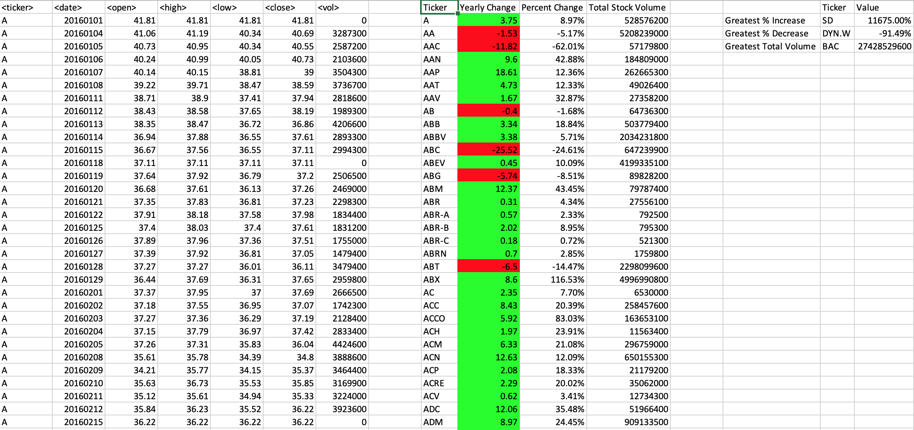
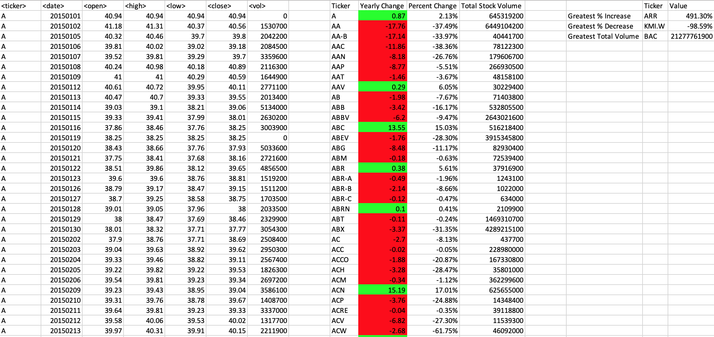
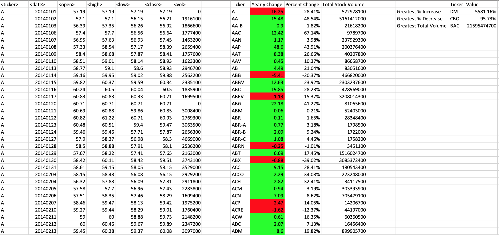

# Stock Analysis
This script will aggreagate data from an excel spreadsheet with stock data.
## Output
The script will produce the following for each stock
-  Stock price change for the year
- Percent change in stock price for the year
- Total Volume for the year
The script will also find:
- The stock with the greatest increase per year per sheet
- The stock with the greatest decrease per year per sheet
- The stock with the greatest volume for the year per sheet 

It will run for all sheets in the excel file. The spreadsheet needs to be set in Sub Main(). Otherwise everything is general.
## Format of Spreadsheet
### Headers
The script expects the data to have columns values for the following data in order
1. ticker
2. date
3. open stock price
4. high stock price
5. low stock price
6. closing stock price
7. volume
### Other formatting
- Date: YearMoDa (e.g. Jan 02, 1994 --> 19940102)
- The data does not need to be sorted in any particular way

## Output from sample file:
### 2016 Results

### 2015 Results

### 2014 Results

